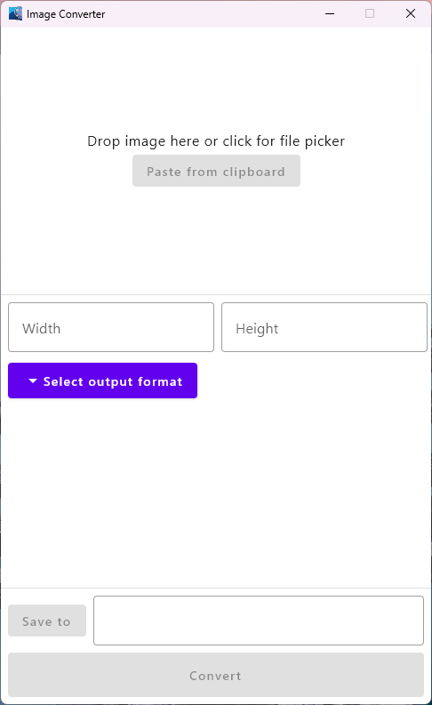

# ImageConverterKotlin

Compose Multiplatform application to convert images to different formats. Uses [Scrimmage](https://github.com/sksamuel/scrimage) for image manipulation.

Run with composeApp -> Tasks -> compose desktop -> run